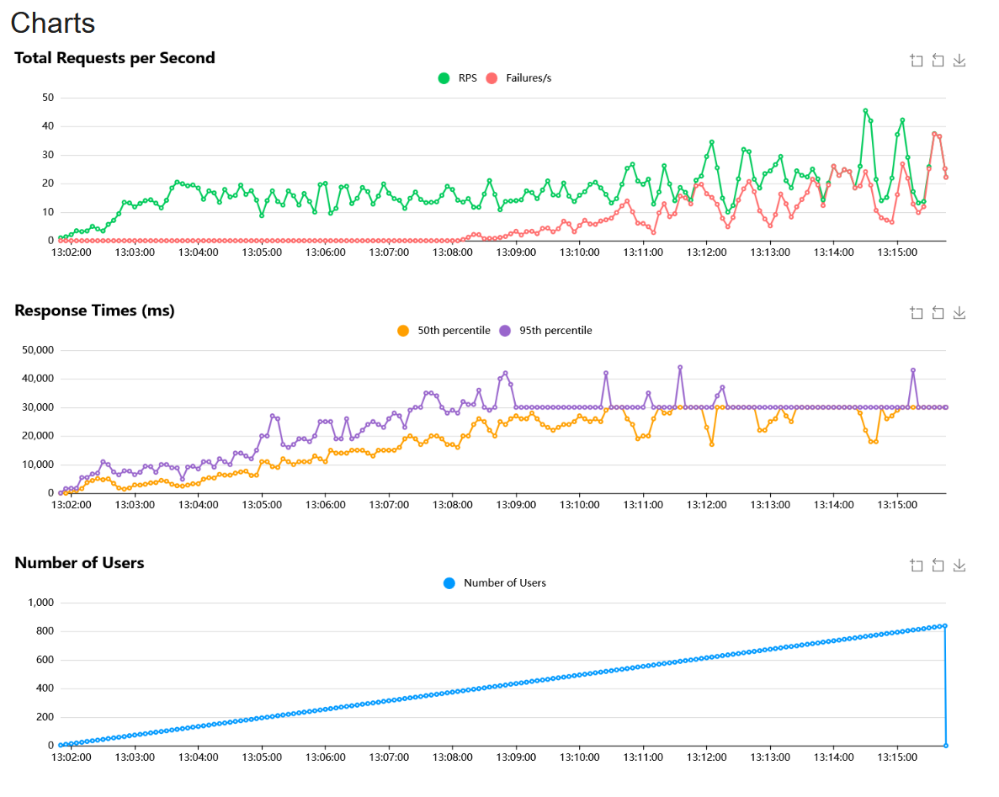
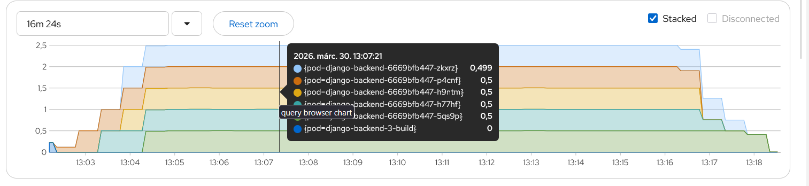
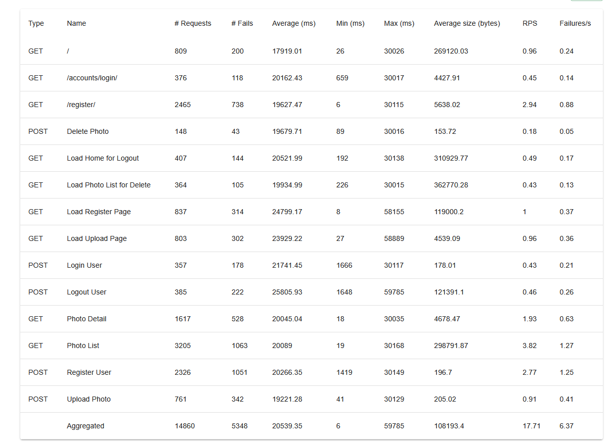
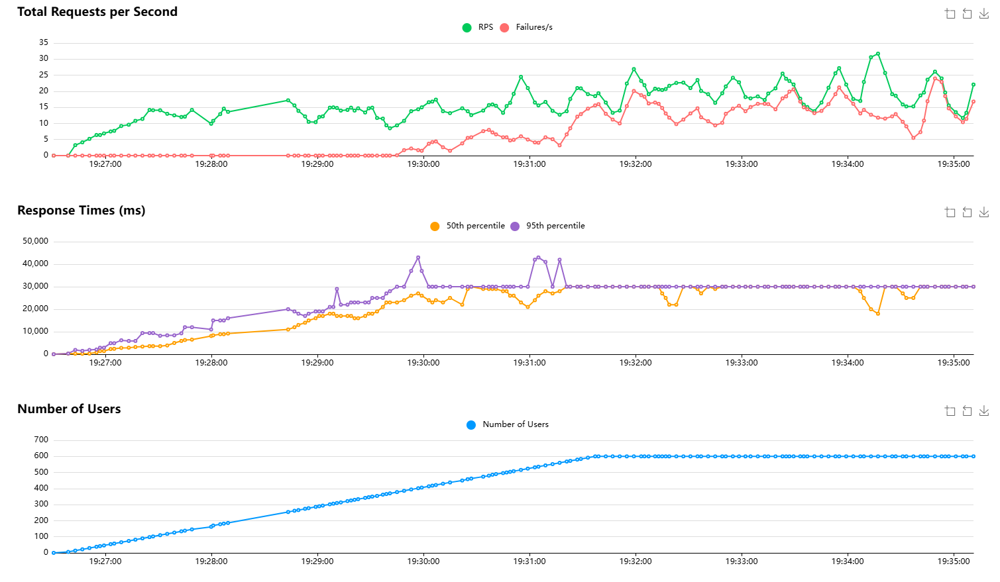

# Infrastruktúra:
- Paas: Redhat Openshift Developer sandbox
- Backend: Python Django
- Frontend: statikus fájlokat szintén a Django szolgálja ki
- Adatbázis: Postgresql + persistent volume claim
    - A képek metadatait, magát a képet és a felhasználó adatokat szintén a postgres-ban tárolom.

# Feladat: 
- &check; Fényképek feltöltése/törlése.
- &check; Miden fényképnek legyen neve (max. 40 karakter), és feltöltési dátuma (év-hó-nap óra:perc)
- &check; Fényképek nevének és dátumának listázása név szerint/dátum szerint rendezve.
- &check; Lista egy elemére kattintva mutassa meg a név mögötti képet.
- &check; Felhasználókezelés (regisztráció, belépés, kilépés).
- &check; Feltöltés, törlés csak bejelentkezett felhasználónak engedélyezett.
- &check; Tetszőleges további opcionális funkciók. (fénykép letöltése)

A backend és a postgresql külön podon fut.
Az github-os automata build nem fut le, mert 403-as error-t dob, amikor jelezni akar az openshift-nek, ezért jelenleg ezzel a paranccsal tudom elindítani a build-et:
```
oc start-build django-backend --follow
```
A build lekéri a legfrissebb kódokat a repo-ból.
A felhasználókezeléshez a django session-t és auth-ot használtam.

# HPA:
Beállítottam az erőforrásokat a backend-nek:
```
resources:
    limits:
        cpu: 500m
        memory: 512Mi
    requests:
        cpu: 200m
        memory: 256Mi
```

Majd létrehoztam egy HPA:
```
oc autoscale deployment/django-backend --min=1 --max=5 --cpu-percent=50
```

Első teszteléséhez ezt használtam:
oc run load-generator --image=busybox --restart=Never -- /bin/sh -c "while true; do wget -q -O- <myservice> > /dev/null; done"

Sikerült is az automatikus skálázás:
```
NAME             REFERENCE                   TARGETS        MINPODS   MAXPODS   REPLICAS   AGE
django-backend   Deployment/django-backend   cpu: 32%/50%   1         5         2          27m
```

## Locust tesztelés:
Létrehoztam egy külön Locust pod-ot ugyanabból a build-ből, mint amiből a django backend volt, csak kicseréltem az indító parancsokat:
        containers:
          command: ["locust"]
          args: 
            - "-f"
            - "locustfile.py"
            - "--host=<BACKEND_URL>"

A locust-tal az összes endpointot teszteltem:


1000 felhasználót teszteltem.


Jól látszik, hogy a rendszer 400 felhasználóig hiba nélkül tud működni.
500 felhasználónál nagyon megnövekedett a hibák száma.
600 felhasználónál a rendszer néhány kérést már nem tud kiszolgálni.
De olyan 750 felhasználónál már nem tudja kiszolgálni a kéréseket, vagy csak nagyon késve




Eredmények:
Final ratio
Ratio Per Class

    100.0% DjangoAppUser
        6.7% deletePhoto
        6.7% loadRegisterPage
        6.7% loginUser
        6.7% logoutUser
        20.0% registerUser
        13.3% uploadPhoto
        13.3% viewPhotoDetail
        26.7% viewPhotoList

Total Ratio

    100.0% DjangoAppUser
        6.7% deletePhoto
        6.7% loadRegisterPage
        6.7% loginUser
        6.7% logoutUser
        20.0% registerUser
        13.3% uploadPhoto
        13.3% viewPhotoDetail
        26.7% viewPhotoList


Kipróbáltam 600 felhasználóval is és hagytam hogy fusson tovább a ramp up után:

Itt is jól látszik, hogy 400 után elkezd hibákat dobni a rendszer.
És a ramp up utána rendes 600 felhasználó alatt sem tud jól működni.


# Terraform
Létrehoztam a , ez által indul el a github action ami build-eli az image-eket
és elküldi az openshift cluster-nek. Csak akkor indul el ez a flow ha, módosul a kód.
Mivel a nevem tartalmaz nagybetűket, ezért van benne egy plusz lépés ami átalakítja a nevemet kisbetűssé a docker image-hez.

Az egyes változókat github-ban tárolom és a terraform, onnan olvassa be, ehhez pluszba létre kellett hoznom a variables.tf, hogy a terraform 
felismerje a változókat a többi terraform fájlban.

Ahhoz hogy kövesse az állapotokat a deploy, ezért elmentem a openshift clusterbe az állapotokat a build-ek között.
Ehhez kellett a 'Log in to OpenShift' és a 'Terraform Init' lépés a config mentéssel. 

A provider.tf-ben van a terraform alap config-ja, database.tf-ben található a postgre sql config-ja és annak a pvc-nek a config-ja.
A backend config-ja a backend.tf-ben található található.

# Parancsok:


