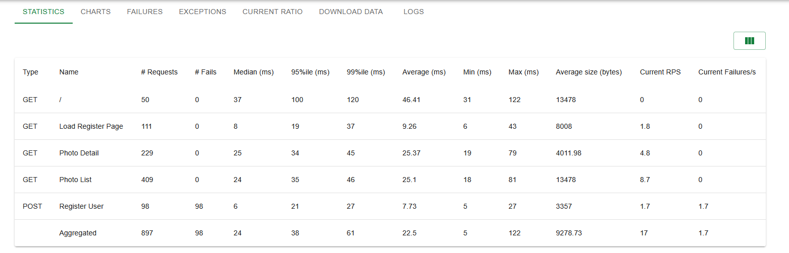
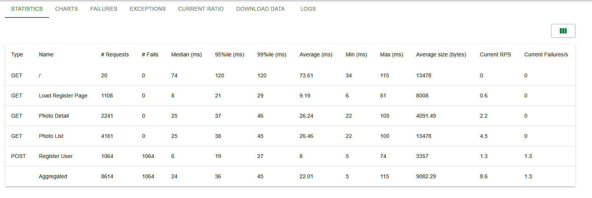

# Infrastruktúra:
- Paas: Redhat Openshift Developer sandbox
- Backend: Python Django
- Frontend: statikus fájlokat szintén a Django szolgálja ki
- Adatbázis: Postgresql + persistent volume claim
    - A képek metadatait, magát a képet és a felhasználó adatokat szintén a postgres-ban tárolom.

# Feladat: 
- &check; Fényképek feltöltése/törlése.
- &check; Miden fényképnek legyen neve (max. 40 karakter), és feltöltési dátuma (év-hó-nap óra:perc)
- &check; Fényképek nevének és dátumának listázása név szerint/dátum szerint rendezve.
- &check; Lista egy elemére kattintva mutassa meg a név mögötti képet.
- &check; Felhasználókezelés (regisztráció, belépés, kilépés).
- &check; Feltöltés, törlés csak bejelentkezett felhasználónak engedélyezett.
- &check; Tetszőleges további opcionális funkciók. (fénykép letöltése)

A backend és a postgresql külön podon fut.
Az github-os automata build nem fut le, mert 403-as error-t dob, amikor jelezni akar az openshift-nek, ezért jelenleg ezzel a paranccsal tudom elindítani a build-et:
```
oc start-build django-backend --follow
```
A build lekéri a legfrissebb kódokat a repo-ból.
A felhasználókezeléshez a django session-t és auth-ot használtam.

# HPA:
Első teszteléséhez ezt használtam:
oc run load-generator --image=busybox --restart=Never -- /bin/sh -c "while true; do wget -q -O- <myservice> > /dev/null; done"

Sikerült is az automatikus skálázás:
```
NAME             REFERENCE                   TARGETS        MINPODS   MAXPODS   REPLICAS   AGE
django-backend   Deployment/django-backend   cpu: 32%/50%   1         5         2          27m
```

Locust-al még nem lett tesztelve.

Locust tesztelés:
10 felhasználó:
NAME             REFERENCE                   TARGETS        MINPODS   MAXPODS   REPLICAS   AGE
django-backend   Deployment/django-backend   cpu: 16%/25%   1         5         1          6d22h

50 felhasználó:

NAME             REFERENCE                   TARGETS        MINPODS   MAXPODS   REPLICAS   AGE
django-backend   Deployment/django-backend   cpu: 54%/25%   1         5         1          6d22h

50 felhasználó skálázással:
NAME             REFERENCE                   TARGETS        MINPODS   MAXPODS   REPLICAS   AGE
django-backend   Deployment/django-backend   cpu: 54%/25%   1         5         5          6d22h

25 felhasználó skálázással:

NAME             REFERENCE                   TARGETS        MINPODS   MAXPODS   REPLICAS   AGE
django-backend   Deployment/django-backend   cpu: 19%/25%   1         5         2          6d22h


# Parancsok:

